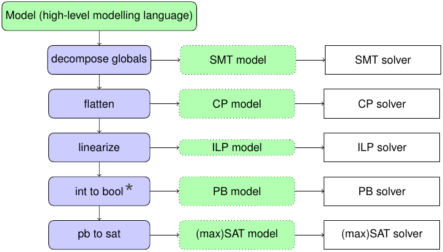

CPMpy: Constraint Programming and Modeling in Python
====================================================

Source code and issue tracker: https://github.com/CPMpy/cpmpy

CPMpy is ideal for solving combinatorial problems like assignment problems or covering, packing and scheduling problems. Problems that require searching over discrete decision variables.

.. toctree::
   :maxdepth: 1
   :caption: Getting started:

   modeling
   summary

.. _supported-solvers:

Supported solvers
-----------------

.. list-table::
   :header-rows: 1

   * - **Solver**
     - **Technology**
     - **Capabilities**
     - **Installation**
     - **Notes**
   * - :doc:`OR-Tools <api/solvers/ortools>`
     - CP (LCG)
     - SAT ASAT ALLSAT - OPT - PAR
     - pip
     - The default solver
   * - :doc:`Pumpkin <api/solvers/pumpkin>`
     - CP (LCG)
     - SAT ASAT ALLSAT - OPT - PROOF
     - local install (maturin)
     - 
   * - :doc:`GCS <api/solvers/gcs>`
     - CP
     - SAT ISAT ALLSAT - OPT - PROOF
     - pip
     -
   * - :doc:`Choco <api/solvers/choco>`
     - CP
     - SAT ISAT ALLSAT - OPT
     - pip
     - 
   * - :doc:`CP Optimizer <api/solvers/cpo>`
     - CP
     - SAT - OPT - PAR
     - pip + local + (aca.) license
     - 
   * - :doc:`MiniZinc <api/solvers/minizinc>`
     - CP
     - SAT - OPT
     - pip + local install
     - Communicates through textfiles
   * - :doc:`Z3 <api/solvers/z3>`
     - SMT
     - SAT ASAT ISAT - OPT
     - pip
     - 
   * - :doc:`Hexaly <api/solvers/hexaly>`
     - Global Opt.
     - SAT ISAT ALLSAT - OPT IOPT
     - pip + local + (aca.) licence
     -
   * - :doc:`Gurobi <api/solvers/gurobi>`
     - ILP
     - SAT ISAT - OPT IOPT - PAR
     - pip + (aca.) license
     - 
   * - :doc:`CPLEX <api/solvers/cplex>`
     - ILP
     - SAT - OPT IOPT - PAR
     - pip + local + (aca.) license
     - No
   * - :doc:`Exact <api/solvers/exact>`
     - Pseudo-Boolean
     - SAT ASAT ISAT ALLSAT - OPT IOPT - PROOF
     - pip >3.10 (Linux, Win)
     - Manual installation on Mac possible
   * - :doc:`RC2 <api/solvers/rc2>`
     - MaxSAT
     - OPT
     - pip
     - 
   * - :doc:`Pindakaas <api/solvers/pindakaas>`
     - SAT
     - SAT ASAT ISAT
     - pip
     - Automatically encodes PB to SAT
   * - :doc:`PySAT <api/solvers/pysat>`
     - SAT
     - SAT ASAT ISAT
     - pip
     - 
   * - :doc:`PySDD <api/solvers/pysdd>`
     - Decis. Diagram
     - SAT ISAT ALLSAT - KC 
     - pip
     - only Boolean variables (CPMpy transformation incomplete)

Native capability abbreviations:
    * SAT: Satisfaction, ASAT: Satisfaction under Assumptions+core extraction, ISAT: Incremental Satisfaction, ALLSAT: All solution enumeration
    * OPT: Optimisation, IOPT: Incremental optimisation
    * PAR: Parallel solving, PROOF: Proof logging, KC: Knowledge Compilation

Different solvers excel at different problems. `Try multiple! <modeling.html#selecting-a-solver>`_

**CPMpy’s transformations** selectively rewrite only those constraint expressions that a solver does not support. While solvers can use any transformation they need, lower-level solvers largely reuse those of higher-level ones, creating a waterfall pattern:

.. toctree::
   :maxdepth: 1
   :caption: Advanced guides:

   how_to_debug
   multiple_solutions
   unsat_core_extraction
   developers
   adding_solver
   testing

Open Source
-----------

CPMpy is open source (`Apache 2.0 license <https://github.com/cpmpy/cpmpy/blob/master/LICENSE>`_) and the development process is open too: all discussions happen on GitHub, even between direct colleagues, and all changes are reviewed through pull requests.

**Join us!** We welcome any feedback and contributions. You are also free to reuse any parts in your own project. A good starting point to contribute is to add your models to the `examples folder <https://github.com/CPMpy/cpmpy/tree/master/examples>`_.

Are you a solver developer? We are keen to `integrate solvers <adding_solver.html>`_ that have a python API on pip. If this is the case for you, or if you want to discuss what it best looks like, do contact us!

.. toctree::
   :maxdepth: 1
   :caption: API documentation:

   api/model
   api/expressions
   api/transformations
   api/solvers
   api/tools
