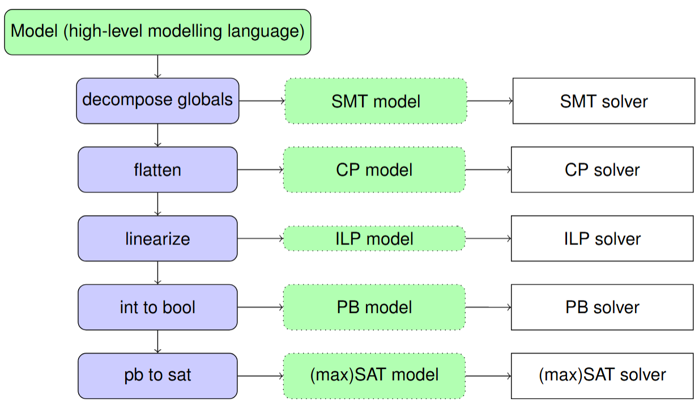

CPMpy: Constraint Programming and Modeling in Python
====================================================

Source code and issue tracker: https://github.com/CPMpy/cpmpy

CPMpy is ideal for solving combinatorial problems like assignment problems or covering, packing and scheduling problems. Problems that require searching over discrete decision variables.

.. toctree::
   :maxdepth: 1
   :caption: Getting started:

   modeling
   summary

.. _supported-solvers:

Supported solvers
-----------------

.. list-table::
   :header-rows: 1

   * - **Solver**
     - **Technology**
     - **Installation**
     - **Assumptions?**
     - **Notes**
   * - :doc:`OR-Tools <api/solvers/ortools>`
     - CP-SAT
     - pip
     - Yes
     - Assumptions NOT incremental! Every solve starts from scratch
   * - :doc:`Choco <api/solvers/choco>`
     - CP
     - pip
     - No
     - 
   * - :doc:`GCS <api/solvers/gcs>`
     - CP
     - pip
     - No
     - Supports proof logging
   * - :doc:`MiniZinc <api/solvers/minizinc>`
     - CP
     - pip + local install
     - No
     - Communicates through textfiles
   * - :doc:`CP Optimizer <api/solvers/cpo>`
     - CP
     - pip + local + (aca.) license
     - No
     - 
   * - :doc:`Gurobi <api/solvers/gurobi>`
     - ILP
     - pip + (aca.) license
     - No
     - 
   * - :doc:`Exact <api/solvers/exact>`
     - Pseudo-Boolean
     - pip >3.10 (Linux, Win)
     - Yes
     - Manual installation on Mac possible
   * - :doc:`Z3 <api/solvers/z3>`
     - SMT
     - pip
     - Yes
     - 
   * - :doc:`PySAT <api/solvers/pysat>`
     - SAT
     - pip
     - Yes
     - Only Boolean variables (CPMpy transformation incomplete)
   * - :doc:`PySDD <api/solvers/pysdd>`
     - SAT Counter
     - pip
     - Yes
     - Knowledge compiler, only Boolean variables (CPMpy transformation incomplete)

Different solvers excel at different problems. `Try multiple! <modeling.html#selecting-a-solver>`_

**CPMpy’s transformations** selectively rewrite only those constraint expressions that a solver does not support. While solvers can use any transformation they need, lower-level solvers largely reuse those of higher-level ones, creating a waterfall pattern:

(* automated int-to-bool not yet supported )

.. toctree::
   :maxdepth: 1
   :caption: Advanced guides:

   how_to_debug
   multiple_solutions
   unsat_core_extraction
   developers
   adding_solver

Open Source
-----------

CPMpy is open source (`Apache 2.0 license <https://github.com/cpmpy/cpmpy/blob/master/LICENSE>`_) and the development process is open too: all discussions happen on GitHub, even between direct colleagues, and all changes are reviewed through pull requests.

**Join us!** We welcome any feedback and contributions. You are also free to reuse any parts in your own project. A good starting point to contribute is to add your models to the `examples folder <https://github.com/CPMpy/cpmpy/tree/master/examples>`_.

Are you a solver developer? We are keen to `integrate solvers <adding_solver.html>`_ that have a python API on pip. If this is the case for you, or if you want to discuss what it best looks like, do contact us!

.. toctree::
   :maxdepth: 1
   :caption: API documentation:

   api/model
   api/expressions
   api/transformations
   api/solvers
   api/tools
