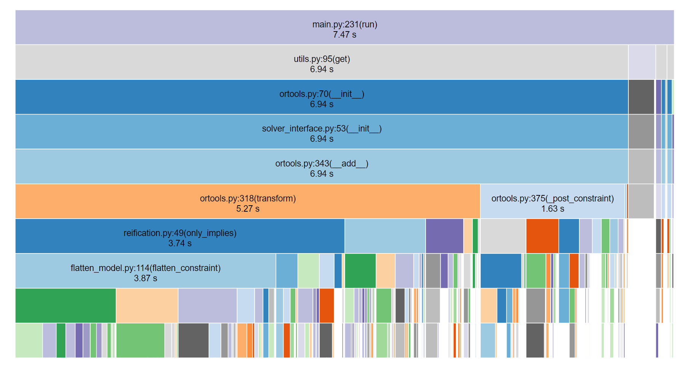

# XCSP3

Everything related to running the XCSP3 competition. This includes:
- automated installers (installer.py)
- the competition cli tool (main.py)
- pytest testsuit on the xcsp3 dataset (./executable/test)

## Setup

Create a new python virtual environment (I recommend to create a `.venv` in this directory) with version 3.11. The competition does not like Anaconda.

```python
virtualenv -p python3.11 .venv
source .venv/bin/activate
```

Install initial libraries
```python
pip install poetry
pip install gitpython
```

Run the installer script
```python
python installer.py
```

Install the python project (remaining dependencies)
```python
poetry install
```

## Competition executable

The CLI tool for the competition is located under `executable/main.py`. It is used as follows:
```
python main.py <benchname> 
    [-s/--seed <RANDOMSEED>] 
    [-l/--time-limit <TIMELIMIT>] 
    [/-o/--time-out <TIMEOUT>] 
    [-m/--mem-limit <MEMLIMIT>] 
    [-c/--cores <NBCORES>] 
    [-t/--tmpdir <TMPDIR>] 
    [-d/--dir <DIR>]                
    [--solver <SOLVER>]             # Name of solver to user
    [--time_buffer <TIMEBUFFER>]    # Time to halt solver before SIGTERM
    [--intermediate]                # If intermediate results should be reported (only for COP and a subset of solvers)
```
For explanation of most of the optional arguments, look at the XCSP3 [competition specification](https://www.cril.univ-artois.fr/~lecoutre/call2024.pdf). The result will be printed to `stdout` in the format defined by the XCSP3 competition. 

## Solution Checker

A solution checker has been provided as an executable jar file. By piping the executable's result to a file, e.g. `python main.py <benchname> > <out_file>`, the SolutionChecker can later read this file and report on its correctness. 

```bash
java -jar xcsp3-solutionChecker-2.5.jar <benchname> <out_file> -cm
```

> [!NOTE]
> The jar seems to just re-solve the problem using an included solver and corss-validate the result. Checking a solution can thus in inself take a while.

## Pytest

A pytest testsuite has been created to automatically run all the XCSP3 competition instances and ensure their correctness using the SolutionChecker. Calling `pytest` within this directory is sufficient to start the test. To have more controll over the test suite's execution, cli arguments are available:

```bash
pytest
    [--solver <SOLVER>]             # Which solver to use
    [--fresh]                       # If previous runs should be re-done / overwritten
    [--time_limit <TIMELIMIT>]      
    [--memory_limit <MEMLIMIT>]
    [--type <BENCHTYPE>]            # cop | csp | main | mini | main-cop | main-csp | mini-cop | mini-csp
    [--intermediate]                # If intermediate results should be reported (only for COP and a subset of solvers)
    [--competition]                 # Competition model, calls executable though its cli instead of python interface
    [--profile]                     # cProfile performance profiling (not compatible with competition mode)
    
```

Most of the arguments are simply passed to the underlying call to the competition executable.

An example command:
```bash
pytest --type=mini-csp --fresh --intermediate --solver=ortools --competition
```

## Profiling

The testsuite can also be used for performance profiling. Using the `--profile` flag with pytest will result in cProfile profiling being saved to the directory `prof`. Using a tool such as [SnakeViz](https://jiffyclub.github.io/snakeviz/) can later be used for interactive exploration.


