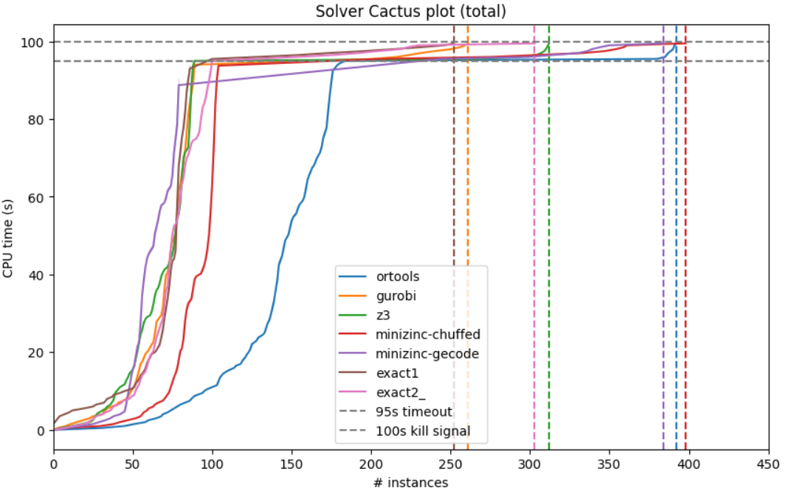

# Submission report

CPMpy has been submitted to the XCSP3 2024 competition on 11/06/2024 :tada:.

This document gives some overview of the work that has been done, so that we can decide what to merge into master. Additionally, the results of our preliminary experiments - where we tried to replicate the competition - are mentioned.

## Contents

1. [Solvers](#1-solvers)
2. [Mock Competition](#2-mock-competition)
	* 2.1. [Solutions found](#21-solutions-found)
	* 2.2. [Resource limits](#22-resource-limits)
	* 2.3. [Issues](#23-issues)
	* 2.4. [Performance](#24-performance)
3. [Changes](#3-changes)
	* 3.1. [General](#31-general)
	* 3.2. [Constraints](#32-constraints)
	* 3.3. [Globals](#33-globals)
	* 3.4. [Performance changes](#34-performance-changes)
4. [Thoughts](#4-thoughts)
5. [Solver issues](#5-solver-issues)

##  1. Solvers

We entered the competition with the following solvers:
- `ortools:9.10.4067`
- `exact:2.1.0`
- `gurobi:11.0.2`
- `z3:4.13.0.0`
- `minizinc:2.8.5`
    - `chuffed`
    - `gecode`

More details about what we submitted can be found [here](./competition.md).

##  2. Mock Competition

We ran all the instances from the 2023 competition. Experiments were done on `himec08`, a 2-socket, 24-cores, 48-threads machine with 128 Gb of memory. Each instance got an 8Gb limit and a 100s timeout (with 5s buffer on the solver timeout).

###  2.1. Solutions found

This table shows the number of solutions that were found for each of the problem types. 

Because of the restrictive 100s timelimit, no solver was able to find a sub-optimal solution to a COP. Either a solution was found and is was proven to be the most optimal one, or no solution was found. We expect this to not be the case for the actual competition, where each instance gets 30 minutes to be solved.

###  2.2. Resource limits

This table shows the number of times that an instance got aborted due to reaching a resource limit, i.e. a timeout or an exhaustion of the available memory.

###  2.3. Issues

This table shows some issues that still remain on certain instances.

For all the tested instances, all constraints were satisfied (so hopefully this means all our implementations of them are correct according to the XCSP3 spec).

The cpmpy error for GeCode is a Minizinc segmentation fault.

The ones for Exact 1 are unsupported expressions (from before multiplication was supported)

The 3 for Exact 2 are `std:exception`s, likely caused by the SIGTERM handeling of the experiment runner (so no real problem here).

###  2.4. Performance

This table shows some of the preformance results, aggregated over all instances.

Next, we have two cactus plots. One visualising the transformation overhead and one the total solve time.

Below the 95s line is visualised on how much instances the solver found the optimal solution to a problem. At the 95s mark, the solver's time-limit is reached. It then still has the chance to return a non-optimal solution or a non-proven-optimal solution. There is some delay before this solution gets returned, motivating the choice for a 5 second buffer untill the actual time-limit of 100s. Anything return beyond that is ignored. The competition has scoring rules for both (proven optimal and non-proven-optimal/non-optimal solutions). In the second setting we see classical CP solvers, like gecode, perform quite well.

##  3. Changes

###  3.1. General

**Minizinc**
- separate check if executable is installed (otherwise complained that python library was not installed, even though it is)

**Gurobi**
- capture gurobi error seperately from ModuleNotFound error

**OR-Tools**
- Return CSP state for CSP problems
	- would before return OPTIMUM for CSP satisfiability
- only post flat objective if non-empty

**Exact 2.1.0**
- change to new version of exact
- takes arguments at construction time instead of solve time
	- had to update SolverLookup.get()
- MuduleNotFoundError instead of ImportError
    - unintentionally captured error inside Exact but reported them as "exact is not installed"

###  3.2. Constraints

**Division**
- a linearization for floor division
- an untested linearization for integer division

**Modulo**
- we had difficulty trying to implement it inside the linearization function
- it gets reformulated using a "//" and using "Abs", so needs to be pushed through the transformation again
- need to call decompose on it (but no access to the "supported" expressions for decomposition inside the linearization function)
- now gurobi and exact have "fake" native support for "Mod" and the linearization is done inside the solver interface

###  3.3. Globals

**New global constraints:**
- AllDifferentExceptN
- AllDifferentLists
- AllDifferentListsExceptN
- AllEqualExceptN
- SubCircuit
- SubCircuitWithStart
- InverseOne
- Channeling
- ShortTable
- NegativeShortTable
- MDD
- Regular
- NegativeTable
- InDomainNested
	- specifically for xcsp3 parser, a "hacky" fix
- NotInDomain
- Precedence
- NoOverlap
- NoOverlap2d
- LexLess
- LexLessEq
- LexChainLess
- LexChainLessEq

**New global functions:**
- Among
- IfTenElseNum

**Updated globals**:
- AllDifferentExcept0
- Inverse
- Table
	- faster decomposition (but only forward)
- IfThenElse
	- check for IncompleteFunctionError
- InDomain
- GlobalCardinalityCount

###  3.4. Performance changes

**Expression store**
- when flattening / linearizing, new variables get created as to split up complex nested expressions
- the same expression can appear in multiple places, thus get converted multiple times
- it is wasteful to have multiple variables representing the exact same expression
- it appears more often for certain types of constraints, certain types of models, certain decompositions (e.g. ShortTable)
- solution is CSE (Common Subexpression Elimination)
	- basic implementation is an expression store (a translation cache)
- currently there is not limit on its size
	- use LRU strategy?
- posting to top level of variable-to-expression translation is done only once

**Expression args setter**
- it is no longer allowed to externally update the private args field of an expression
	- an exception gets raised if someone still tries to
- new update_args() method
	- will update the expression's args field
	- will reset cached values which depend on the args
		- maybe variants of update_args() to prevent unnecesary resets

**Has subexpression**
- certain transformations (like decompose_in_tree) only need to be called recursively if there are nested subexpressions. 
- we can check if there is a subexpression, if not we spare a recursion
- is calculated at first need & cached for later use
- still opportunities in "Comparison" section of "decompose_in_tree"
- also replaces all(__is_flat_var(arg)) expressions
	- more reuse of cached value

**Skip simplify_bool**
- some transformations are nested inside flatten_constraint (toplevel_list, push_down_negation, simplify_boolean)
- not all calls to flatten_constraint need these nested transformations
	- flatten_constraint calls itself, so simplify_boolean does not need to be done again

**Extend instead of recurse**
- in flatten_constraint, many recursive calls get made
- can just as easily be done by extending the "list to be transformed"
- results in an iterative approach

**Vars & args**
- vars field returns a subset of the args, only the ones that actually represent variables
- for now only used on table constraint, where the table of constants is much larger than the array of variables
- prevent wasting space by pushing constants through the transformations

**linearize_constraint helper**
- a new helper function that now returns two things: a list of linearized constraints + a list of newly introduced decision variables during the linearization
- previously, a recursive function looked for these variables after the transformation
- now they are kept track of during transformation

**Is leaf**
- a new method for each expression returning whether it is a leaf expression (so a decision variable, an array of decision variables)
- is cached

**Push down negation**
- early exit for leaf expressions
- has_nested_negation is not finished / did not work correctly
	- more edge cases than expected
    - more difficult to keep track of when expression tree changes

**Simplify boolean**
- short-circuit opportunities
- more difficult to detect when in mixed setting
	- `... <= -(BoolVal(True))`
- consistent use of BoolVal?
- issue with globals
	- disabled for now
	- e.g. in XOR, cannot really remove boolean constants without changing the meaning

**Simplified "Abs" decomposition**
- when not crossing 0

**Faster type checks**
- prevent nested calls between is_num, is_int and is_bool

Improved argval() + new argvals()

##  4. Thoughts

**Mod should be a partial function**
- x % 0 deviates from the normal definition of "Mod"
- right now we don't allow y to be or to contain 0

**Integer division**
- differs from float division when using negative numbers
- un-tested implementation made
- "//" in python should mean floor division (python does not have native int-div operator)
- inconsistent between solvers

**Add improvements to other solvers** 
- pysat
- pysdd

**More build-in solver parameters?**
- now that we did the work to correctly translate them to each of the solvers
- seed
- memory
- nr cores

##  5. Solver issues

**Gurobi**
- no license + model too large for free + callback function!
- error: `Unable to retrieve attribute 'x'`
- will not check for license, will try to solve, will silently fail due to model too large, will try to get solution which does not exist

**OR-Tools**
- solveAll() + 'num_workers' fails
- parallelism not supported when solveAll()
- error is silent
	- cpmpy or ortools issue? (that the error is silent)
	- log_search_progress=True reveals the error

**Exact**
- ignores some SIGTERMS
- main program (caller) has a sigterm handler
	- exists with code 0
- exact keeps running + ignores set timelimit

**Minizinc (gecode + chuffed)**
- on `BinaryPuzzle-6.xml` (checking instance of 2024) does not return correct number of solutions when doing solveAll() + each reports a different number